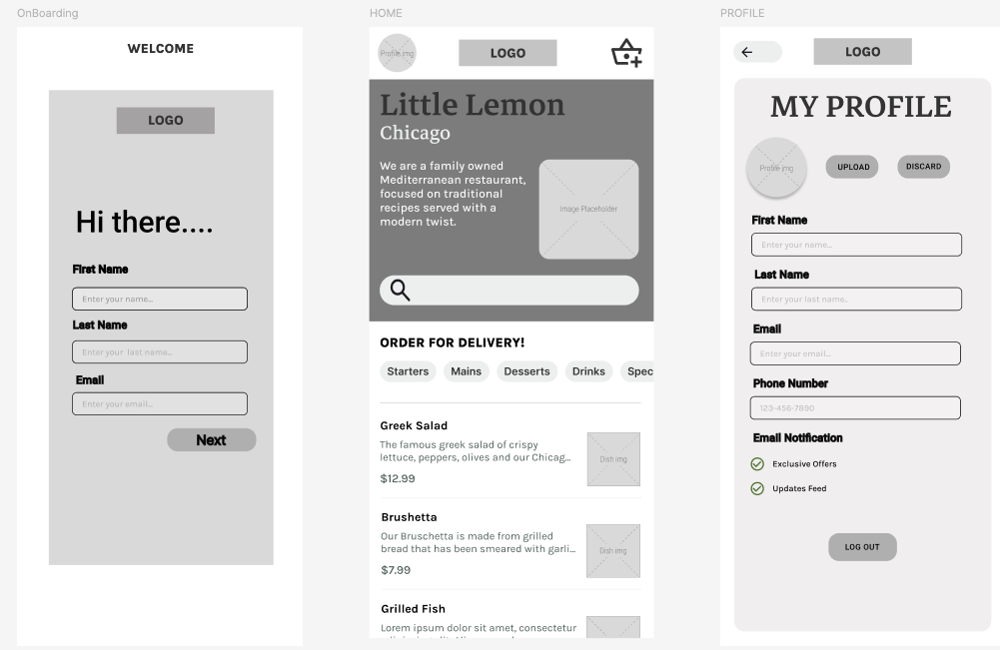

# 🍋 Little Lemon App

A React Native capstone project built for the Meta Front-End Developer course. This mobile app simulates a food ordering experience for Little Lemon, a Mediterranean restaurant based in Chicago.

---

## 🚀 Features

- 🧾 **Onboarding Flow**: Collects user profile data and stores it in SQLite.
- 👤 **Profile Management**: Displays and updates user info with image picker and preferences.
- 🍽️ **Menu Browser**: Fetches categorized menu items from a remote API.
- 🔍 **Search & Filter**: Allows users to search and filter menu items by category.
- 🧠 **Local Persistence**: Uses SQLite for profile and menu data, with fallback logic.
- 🎨 **Custom Fonts & Styling**: Uses Karla font and a Mediterranean-inspired UI.

---

## 🛠️ Tech Stack

- **React Native** (Expo)
- **TypeScript**
- **SQLite** via `expo-sqlite`

  
----
## 🖼️ Wireframe Preview
- 🎨 Figma : https://www.figma.com/design/c6pmaWfsNaSuNFXwX2KHg6/canvas?m=auto&t=INZtcAkUVaFcEXQS-6
  




## 🚀 Demo


---

## 📦 Installation

```bash
git clone https://github.com/HuyNLy/Little-Lemon-App.git
cd Little-Lemon-App
npm install
npx expo start
